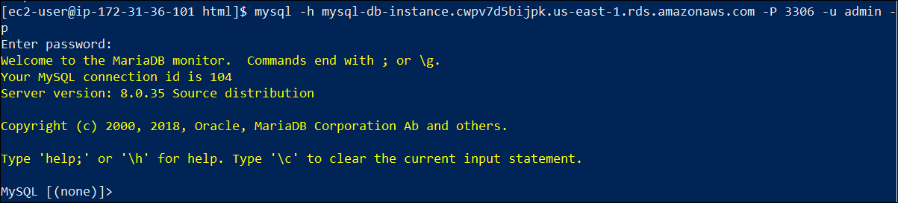
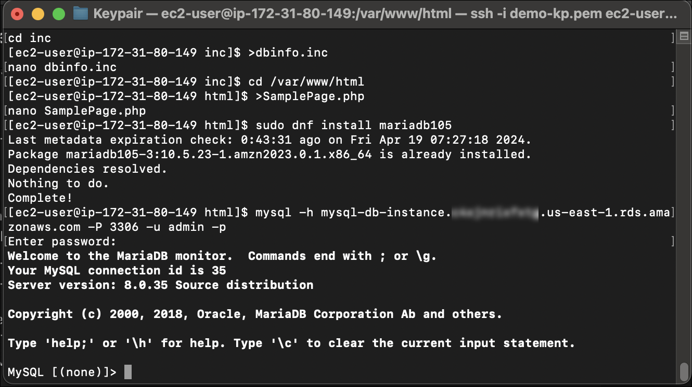
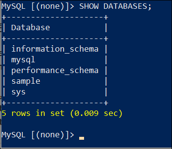
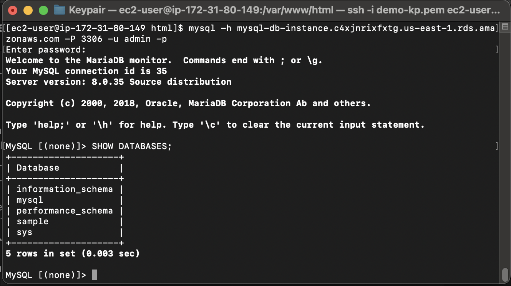
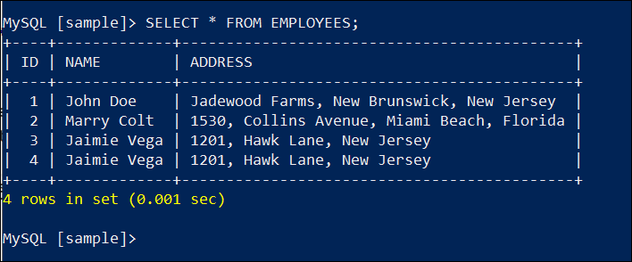
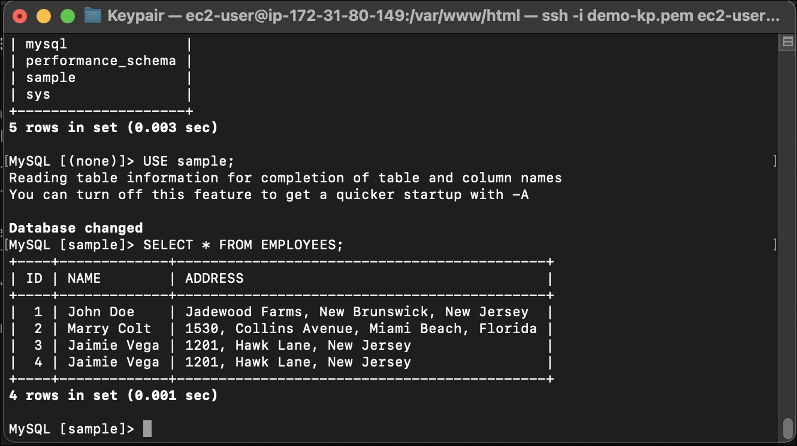

# Exercise 3: Accessing the MySQL DB instance through Web server

After **Amazon RDS** provisions your DB instance, you can use any standard MySQL client application or utility to connect to the instance. In the connection string, you specify the DNS address from the DB instance endpoint as the host parameter, and specify the port number from the DB instance endpoint as the port parameter.

## Task 1: Install the MySQL command-line client on the Web server

In this task, you will install the MySQL command-line client on the Web server to access the database you have created using RDS MySQL DB instance using the **endpoint**, **user name** and **password** for the DB instance by following the given steps:

1. With your EC2 instance SSH connection open, enter the following command to download MariaDB client as MySQL command-line client:

    `sudo dnf install mariadb105`

1. To connect to a DB instance using the MySQL command-line client, enter the following command at the command prompt.

    `mysql -h mysql–instance1.123456789012.us-east-1.rds.amazonaws.com -P 3306 -u mymasteruser -p`

    For the **-h** parameter, substitute the DNS name (endpoint) for your DB instance. For the **-P** parameter, substitute the port for your DB instance. For the **-u** parameter, substitute the user name of a valid database user ie. **admin**. Enter the master user password when prompted, ie. **admin123**.

1. As the authentication becomes successful, the following screen will appear.

    

    Now you, can access the data and perform various actions on it using SQL commands.

    **For Mac Users:** You will also get an output similar to the screen below:

    

## Task 2: Access the Amazon RDS Database through MySQL client

After a successful authentication to your database through the web sevrer, in this task, you will be listing the available databases present in your DB instance, and also view the table that has been created under the **sample** database you created while creating the RDS MySQL instance. After this, you will analyze the entries created in the table by following the given steps:

1. To see the database, provide `SHOW DATABASES;` and hit **Enter**. You will get a list of all the databased in your RDS MySQL database instance, named **mysql-db-instance**.

    

    You will find your database named **sample** in the table. Other databases are pre-created by AWS and are utilized for internal purpose.

    **For Mac Users:** You will also get an output similar to the screen below:

    

1. To see the table where your entries are made, you first need to choose the database where your table is present using the command `USE database_name;`. Here, database_name is the name of your database i.e. **sample**.

1. Now, you can use the command `SHOW TABLES;` to see all the tables in the database named as **sample**. As there is only 1 table created where your entries exist, thus, you will only get the name of a single table., named **EMPLOYEES**.

1. To view the data that is present in the **EMPLOYEES** table in the **sample** database, provide the following command:

    `SELECT * FROM table_name;`

    Here, **table_name** is the name of your table, i.e. **EMPLOYEES**.

1. You will be presented with the table containing all the entries which you created in the **SamplaPage.php**.

    

    You can verify that even if you create a duplicate entry with all information repeated, the **ID** will still be presented as diferent.

    **For Mac Users:** You will also get an output similar to the screen below:

    

**Now, you've seen how you can integrate the RDS database using an EC2 instance, and access it using command line from the instance as well. You can also try more SQL queries of different kinds on the table and verify the outputs.**
